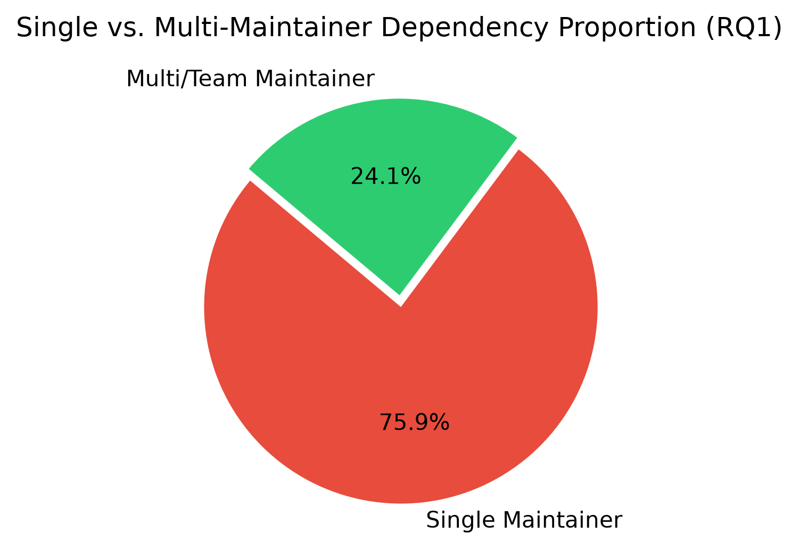
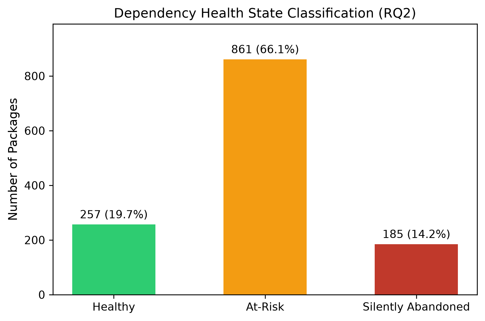
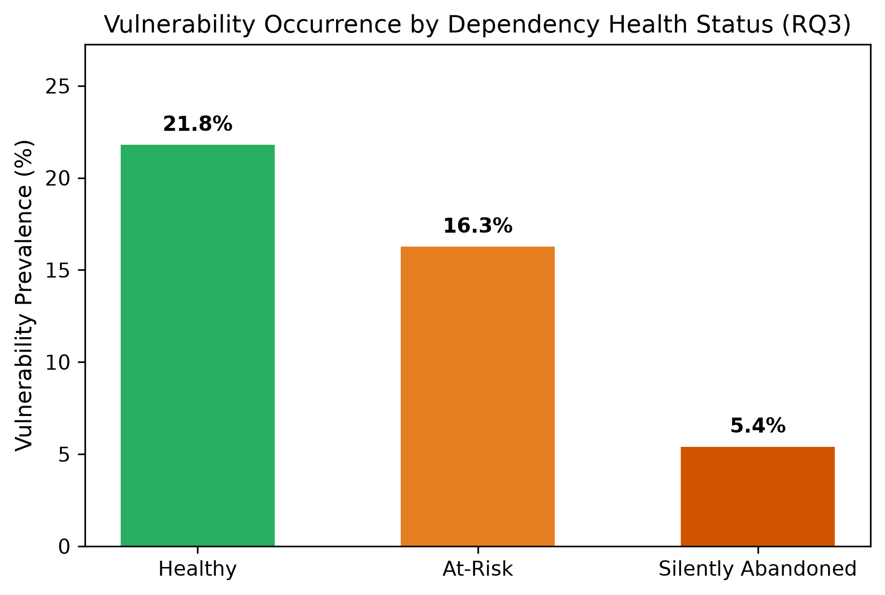
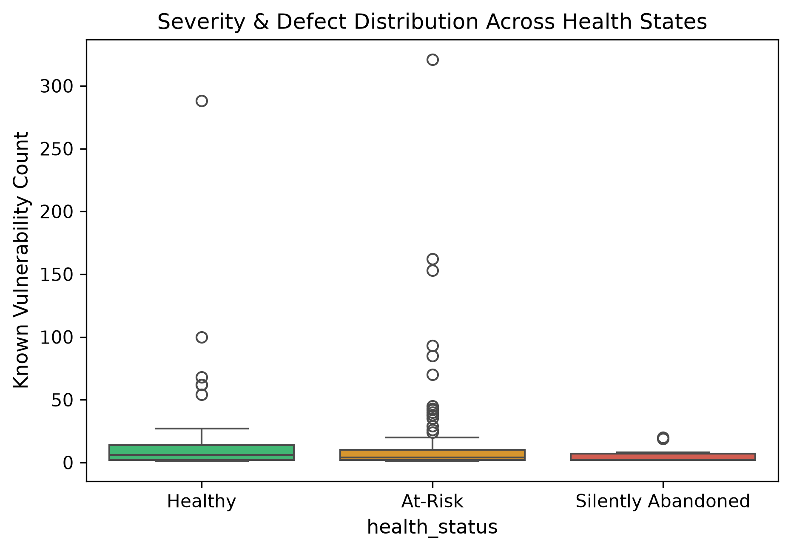

# Silent Abandonment in the Python Ecosystem

**An Empirical Study of Maintenance Risk in Critical PyPI Dependencies**

[](https://doi.org/10.5281/zenodo.23007343)
[](LICENSE)
[](LICENSE-CC-BY-4.0)
[](https://www.python.org/downloads/)

---

## Abstract

Modern software systems heavily depend on open-source packages distributed
through ecosystem registries such as PyPI. When upstream maintainers silently
abandon a package — ceasing development without formal deprecation — every
downstream project inherits unpatched vulnerabilities and compatibility risks.

This study empirically analyses the top 1,000 most-downloaded PyPI packages and
their transitive dependency trees to quantify single-maintainer prevalence,
silent abandonment rates, and the statistical association between maintenance
inactivity and known security advisories. Our dataset, analysis scripts, and
all figures are released under an open licence.

**Data snapshot: 2026-09-28.**

---

## Key Findings

| # | Finding | Value |
|---|---------|-------|
| **RQ1** | Packages with a single maintainer | **989 / 1,303 (75.9%)** |
| **RQ1** | Packages with multi/org maintainers | 314 / 1,303 (24.1%) |
| **RQ2** | Silently abandoned (≥ 18 months inactive) | **185 / 1,303 (14.2%)** |
| **RQ2** | At risk (12–18 months inactive, or active but solo) | **861 / 1,303 (66.1%)** |
| **RQ2** | Healthy (active and team-backed) | **257 / 1,303 (19.7%)** |
| **RQ3** | Packages with ≥ 1 known OSV advisory | **206 / 1,303 (15.8%)** |
| **RQ3** | χ² (Yates continuity-corrected, df = 1) | **8.0513**, *p* = **0.0046** |
| **RQ3** | Effect size — Cramér's V | **0.079** *(weak)* |
| **RQ3** | Effect size — Odds ratio | **0.60** |
| **RQ3** | Logistic regression, `abandoned_flag` | **β = −1.490**, *p* = **0.0037** |

**The three health states are mutually exclusive and exhaustive** (257 + 861 + 185 = 1,303).
Total unhealthy = **80.3%**.

**Vulnerability rate by health state** — the contrast that the published paper's
pooled table obscures:

| Health state | With ≥ 1 advisory | Rate |
|---|---|---|
| Healthy | 56 / 257 | **21.8%** |
| At risk | 140 / 861 | **16.3%** |
| Silently abandoned | 10 / 185 | **5.4%** |

The headline RQ3 result — abandoned packages log *fewer* CVEs — is an
**"undiscovered defect" blindspot**: dormant repositories lack active
maintainers to triage disclosure reports, not because they are more secure.

> ⚠️ **The χ² is statistically significant but the effect is weak** (Cramér's V = 0.079).
> Read the association, not the headline p-value. See [Limitations](#limitations).

### Figures

| | |
|---|---|
|  |  |
| **Fig 1** — Single vs. multi-maintainer packages (RQ1) | **Fig 2** — Dependency health state classification (RQ2) |
|  |  |
| **Fig 3** — Vulnerability prevalence by health state (RQ3) | **Fig 4** — Advisory counts across health states (RQ3) |

---

## Research Questions

| # | Question | Answer |
|---|---|---|
| **RQ1** | What proportion of critical PyPI packages rely on a single maintainer? | 75.9% |
| **RQ2** | How prevalent is silent abandonment (≥ 18 months inactive) among dependencies of the top 1,000 PyPI packages? | 14.2% abandoned, 66.1% at risk |
| **RQ3** | Is there a statistically significant association between abandonment indicators and known security advisories? | Yes, χ² = 8.05, *p* = 0.0046 — but weakly, V = 0.079 |

---

## Tech Stack

Plain Python. No frameworks, no database, no build step — six scripts plus one
shared config module.

### Language & runtime

| | |
|---|---|
| Language | Python **3.10+** (developed and verified on 3.14.5) |
| Dependency manifest | [`requirements.txt`](requirements.txt) |
| Config | [`config.py`](config.py) — shared constants, HTTP sessions, retry logic |

### Data sources (external APIs)

| Source | Used by | What it provides |
|---|---|---|
| [hugovk top-pypi-packages](https://hugovk.github.io/top-pypi-packages/) | script 01 | Top-1,000 packages by 30-day download count |
| [PyPI JSON API](https://docs.pypi.org/api/json/) | script 02 | `requires_dist` dependency graph, versions, authors, release dates |
| [GitHub REST API](https://docs.github.com/en/rest) | script 03 | Repo stars/forks, last commit, contributor activity, archival flag |
| [OSV.dev](https://osv.dev/) | script 04 | Security advisories (GHSA + PYSEC + CVE) |

All four are accessed with [`requests`](https://requests.readthedocs.io/) via a
polite `User-Agent` and a shared retry/backoff helper
([`config.py:75`](config.py)). GitHub calls additionally use
`X-GitHub-Api-Version: 2022-11-28`.

### Libraries

| Purpose | Library | Version | Notes |
|---|---|---|---|
| HTTP client | `requests` | ≥ 2.31.0 | Sessions, header config, rate-limit retries |
| Secrets / env | `python-dotenv` | ≥ 1.0.0 | Loads `.env` for `GITHUB_TOKEN` |
| Data frames | `pandas` | ≥ 2.1.0 | All CSV I/O, merges, `crosstab` |
| Requirement parsing | `packaging` | ≥ 23.2 | PEP 508 `Requirement` parsing in script 02 |
| Statistics | `scipy` | ≥ 1.11.0 | `chi2_contingency` |
| Regression | `statsmodels` | ≥ 0.14.0 | `Logit` binary logistic regression |
| Plotting | `matplotlib` | ≥ 3.8.0 | 300 DPI publication output |
| Plotting | `seaborn` | ≥ 0.13.0 | Box plots |
| Progress bars | `tqdm` | ≥ 4.66.0 | Long API loops |

---

## Methodology

```
01  Collect top-1,000 packages   hugovk snapshot
        ↓
02  Resolve dependency trees     PyPI JSON API, PEP 508, max depth 5 (reached: 2)
        ↓
03  GitHub metadata              REST API — commits, contributors, stars
        ↓
04  Vulnerability scan           OSV.dev — GHSA / PYSEC / CVE
        ↓
05  Classify                     healthy / at_risk / silently_abandoned
        ↓
06  Analyse & visualise          χ², Cramér's V, odds ratio, logistic regression, 4 figures
```

### Operational definitions

Applied by [`05_classify_packages.py`](scripts/05_classify_packages.py), with
thresholds from [`config.py`](config.py):

| State | Criteria |
|---|---|
| **Silently abandoned** | Repository **archived**, **or** no release *and* no commit for ≥ 18 months |
| **At risk** | 12–18 months of inactivity, **or** active but maintained by a single developer |
| **Healthy** | Released within the last 12 months **and** team- or organisation-backed |

Evaluation precedence: `is_archived` → recency of latest activity →
single-maintainer check. Packages with no date information at all fall back to
`at_risk`.

> Thresholds are implemented as `months × 30` days, so the effective windows are
> **17.7** and **11.8** months rather than exactly 18 and 12.

### Statistical tests

| Test | Function | Applied to |
|---|---|---|
| χ² test of independence | `scipy.stats.chi2_contingency` | 2×2 table: `(at_risk ∪ abandoned)` × `has_vuln` |
| Cramér's V | derived from χ² | Effect size for the above |
| Odds ratio | derived from the 2×2 table | Direction and magnitude of association |
| Logistic regression | `statsmodels.Logit` | `has_vuln` ~ `abandoned_flag` + `at_risk_flag` + `single_maint_flag` |

> The χ² reported as `8.0513` is `scipy`'s **default Yates continuity
> correction** for 2×2 tables, not uncorrected Pearson. Uncorrected Pearson on
> the same data is χ² = 8.6019, *p* = 0.00336. Both reject independence at α = 0.01.

---

## Repository Structure

```
.
├── README.md                        ← you are here
├── CITATION.cff                     Citation metadata (GitHub "Cite" button)
├── LICENSE                          MIT — source code
├── LICENSE-CC-BY-4.0                CC BY 4.0 — dataset & manuscript
├── requirements.txt                 Python dependencies
├── .env.example                     Template for GITHUB_TOKEN
├── config.py                        Shared constants, HTTP sessions, retry logic
├── scripts/
│   ├── 01_collect_top_packages.py   Fetch top-1000 PyPI packages
│   ├── 02_resolve_dependencies.py   Build dependency graph (depth ≤ 5)
│   ├── 03_collect_github_metadata.py  Gather repo-level health signals
│   ├── 04_collect_vulnerabilities.py  Query OSV.dev for advisories
│   ├── 05_classify_packages.py      Label healthy / at-risk / abandoned
│   └── 06_analyze_and_visualize.py  Statistics + 4 publication figures
├── data/                            Collected datasets (CSV)
│   ├── DATA_DICTIONARY.md           ← column-by-column documentation
│   ├── top_packages.csv             1,000 seeds
│   ├── dependencies.csv             3,022 edges
│   ├── package_metadata.csv         1,303 packages
│   ├── github_metadata.csv          1,303 packages  ⚠️ largely empty, see Limitations
│   ├── vulnerabilities.csv          1,303 packages
│   ├── classified_packages.csv      1,303 packages  ← primary analytical dataset
│   └── statistics_summary.csv       10 aggregate metrics
├── figures/                         Generated charts (PNG, 300 DPI)
└── paper/
    ├── paper.pdf                    Camera-ready PDF
    ├── paper.tex                    IEEEtran LaTeX source
    ├── paper.md                     Markdown manuscript
    ├── index.html                   Standalone HTML viewer
    └── references.bib               BibTeX bibliography
```

Also present: [`plan.md`](plan.md) — project scope, completion status, and roadmap.

---

## Dataset

**Full column-level documentation: [`data/DATA_DICTIONARY.md`](data/DATA_DICTIONARY.md).**

| File | Rows | Contents |
|---|---|---|
| `top_packages.csv` | 1,000 | Seed packages with download rank and 30-day count |
| `dependencies.csv` | 3,022 | Directed parent → dependency edges with depth |
| `package_metadata.csv` | 1,303 | PyPI metadata: version, summary, author, licence, repo URL |
| `github_metadata.csv` | 1,303 | Intended GitHub signals — **mostly failed, see Limitations** |
| `vulnerabilities.csv` | 1,303 | OSV advisory counts, IDs, dates, severity flags |
| `classified_packages.csv` | 1,303 | **Primary analytical dataset** — all merges plus derived fields |
| `statistics_summary.csv` | 10 | Headline metrics for RQ1–RQ3 |

### Provenance

| | |
|---|---|
| Snapshot date | **2026-09-28** |
| Seed selection | Top 1,000 by 30-day downloads (156.59 B downloads/month total) |
| Download range | 20,352,774 (rank 1,000) → 3,206,668,324 (rank 1) |
| Universe | 1,000 seeds ∪ all resolved dependencies = **1,303 packages** |
| Advisory source | OSV.dev, aggregating GHSA, PYSEC, and CVE |

### Quick start

**You do not need to run the pipeline.** All seven CSVs are committed and ready
to use:

```python
import pandas as pd

df = pd.read_csv("data/classified_packages.csv")

# Abandoned packages with wide blast radius
risk = df[
    (df["health_status"] == "silently_abandoned")
    & (df["dependent_count"] >= 5)
].sort_values("dependent_count", ascending=False)

print(f"{len(risk)} abandoned packages with 5+ dependents")
```

> Read the sentinel conventions in the [data dictionary](data/DATA_DICTIONARY.md#conventions-used-across-all-files)
> first — `-1` means "API call failed", not a real value.

---

## Reproduction

### Prerequisites

- Python 3.10+
- A GitHub Personal Access Token — **only needed for script 03**, which raises
  the API rate limit from 60 req/h (anonymous) to 5,000 req/h (authenticated).
  A classic token with no scopes is sufficient; all data collected is public.

### Setup

```bash
git clone https://github.com/raihan-sifat/pypi-dependency-health-study.git
cd pypi-dependency-health-study
python -m venv .venv

# Windows
.venv\Scripts\activate
# macOS / Linux
# source .venv/bin/activate

pip install -r requirements.txt
```

### Configure

Copy the template and add your token (only required for script 03):

```bash
cp .env.example .env       # Windows: copy .env.example .env
```

```
GITHUB_TOKEN=ghp_YOUR_PERSONAL_ACCESS_TOKEN
```

`.env` is git-ignored. The pipeline still runs without a token — script 03 will
simply hit rate limits (this is the likely cause of the empty GitHub data
shipped in `github_metadata.csv`).

### Run the pipeline

Scripts must run in order; each depends on the previous one's output.

```bash
python scripts/01_collect_top_packages.py
python scripts/02_resolve_dependencies.py
python scripts/03_collect_github_metadata.py   # slowest — needs a token
python scripts/04_collect_vulnerabilities.py
python scripts/05_classify_packages.py
python scripts/06_analyze_and_visualize.py
```

### What each stage costs

| Script | Runtime | Network calls | Notes |
|---|---|---|---|
| 01 | seconds | 1 | Single JSON fetch |
| 02 | ~10–30 min | ~1,300 | 0.1 s politeness delay per PyPI call |
| 03 | **hours** | **~10,000+** | ~10 calls/repo × 1,185 repos at 0.8 s delay. **Requires a token.** |
| 04 | ~10–20 min | 1,300 | 0.2 s delay per OSV query |
| 05 | seconds | 0 | Local joins and classification |
| 06 | seconds | 0 | Statistics and figures |

### Expected output

`06_analyze_and_visualize.py` writes `data/statistics_summary.csv` and the four
PNGs in `figures/`.

### Troubleshooting

| Symptom | Cause and fix |
|---|---|
| `ModuleNotFoundError: No module named 'dotenv'` | `pip install -r requirements.txt` — `python-dotenv` is required by `config.py` |
| Script 03 stalls or GitHub columns come back all `-1` | No `GITHUB_TOKEN`, or rate limit exhausted. Add a token and re-run |
| `FileNotFoundError` on `data/top_packages.csv` | Scripts must run in order — start at 01 |
| Health-state counts differ from the README | Cut-offs are computed from `datetime.now()` at run time, not the fixed snapshot date. See [Limitations](#limitations) |

---

## Limitations

Stated plainly so that anyone reusing this work is not surprised. The
manuscript's "Threats to Validity" section covers these from a research
perspective; the [data dictionary](data/DATA_DICTIONARY.md#caveats) covers them
column by column.

### 1. GitHub enrichment failed in this snapshot

In the shipped `github_metadata.csv`, `stars`, `forks`, and `open_issues` are
`-1` for **all 1,303 rows**, `active_contributors_24m` is `1` for all rows, and
`is_archived` / `is_fork` are the default `False` for all rows. Only
`last_commit_date` carries usable data. Re-run script 03 with a valid token to
populate the rest.

Consequently, no column in this dataset reflects real contributor or commit
topology information.

### 2. Single-maintainer status is a keyword heuristic, not a measurement

`is_single_maintainer` is computed by substring-matching the PyPI `author` string
and `repo_url` against 25 hardcoded tokens. **522 of the 989** single-maintainer
packages have an **empty `author`** and are labelled single by default; 47 have
neither author nor GitHub data. Known misclassifications include `numpy`,
`typing-extensions`, `urllib3`, `cryptography`, and `pydantic`.

The `SINGLE_MAINTAINER_COMMIT_THRESHOLD` constant intended to ground this in
commit data is declared in `config.py` but referenced by no script.

### 3. The dependency graph reaches depth 2, not 5

`02_resolve_dependencies.py:189` pre-seeds the recursion guard with all 1,000
seed names, so any dependency that is itself a top-1,000 package is never
expanded. Depths 3–5 contain **zero** edges, and 375 of the 1,000 seeds produced
no edges at all. Claims of a "complete" graph to depth 5 do not hold for this
snapshot.

### 4. RQ3's central contrast rests on 10 events

Only **10 of 185** abandoned packages have a known advisory (5.4%), versus 56 of
257 healthy packages (21.8%). That single thin cell drives the reported
logistic-regression coefficient (β = −1.4901, *p* = 0.0037). No exact test,
leave-one-out analysis, or threshold sensitivity analysis accompanies it.

### 5. Advisory counts are inflated and severity flags are unreliable

OSV records are not deduplicated across GHSA/PYSEC/CVE, so one CVE mirrored in
three databases counts three times (`django` = 321, `apache-airflow` = 288).
`has_critical` and `has_high` undercount because CVSS *vector* strings are
matched against literal severity labels and never match. Figure 4 is built on
these counts.

### 6. Thresholds and cut-offs are not pinned to the snapshot

The 18- and 12-month windows are implemented as `months × 30` days — **17.7**
and **11.8** months. Cut-offs derive from `datetime.now()` at run time rather
than the 2026-09-28 snapshot date, so re-running shifts the 185 / 861 / 257
partition.

### 7. The shipped CSV does not match the current script

`github_metadata.csv` has 10 columns; the current
`03_collect_github_metadata.py` emits 13 (adding `open_prs`,
`total_contributors`, `default_branch`). The shipped CSV was not produced by the
shipped code, so re-running will change its shape.

---

## Citation

If you use this dataset, code, or manuscript, please cite it:

```bibtex
@misc{raihan2026silent,
  author       = {Raihan, Sifat},
  title        = {Silent Abandonment in the Python Ecosystem: An Empirical
                  Study of Maintenance Risk in Critical PyPI Dependencies},
  year         = {2026},
  publisher    = {Zenodo},
  doi          = {10.5281/zenodo.23007343},
  url          = {https://doi.org/10.5281/zenodo.23007343},
  note         = {Dataset snapshot 2026-09-28; 1,303 packages, 3,022 dependency edges}
}
```

Repository metadata is also available in [`CITATION.cff`](CITATION.cff), which
GitHub surfaces via the **Cite** button.

---

## Licence

| Artefact | Licence |
|---|---|
| Source code (`config.py`, `scripts/`) | [MIT](LICENSE) |
| Dataset (`data/`) | [CC BY 4.0](LICENSE-CC-BY-4.0) |
| Manuscript (`paper/`) | [CC BY 4.0](LICENSE-CC-BY-4.0) |
| Figures (`figures/`) | [CC BY 4.0](LICENSE-CC-BY-4.0) |

---

## Author

**Sifat Raihan**
Hebei University of Science and Technology, Shijiazhuang, China
[github.com/raihan-sifat](https://github.com/raihan-sifat) ·
[10.5281/zenodo.23007343](https://doi.org/10.5281/zenodo.23007343)